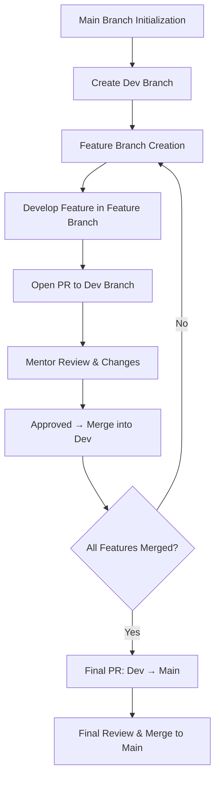
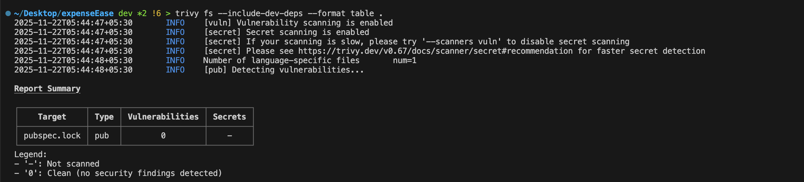
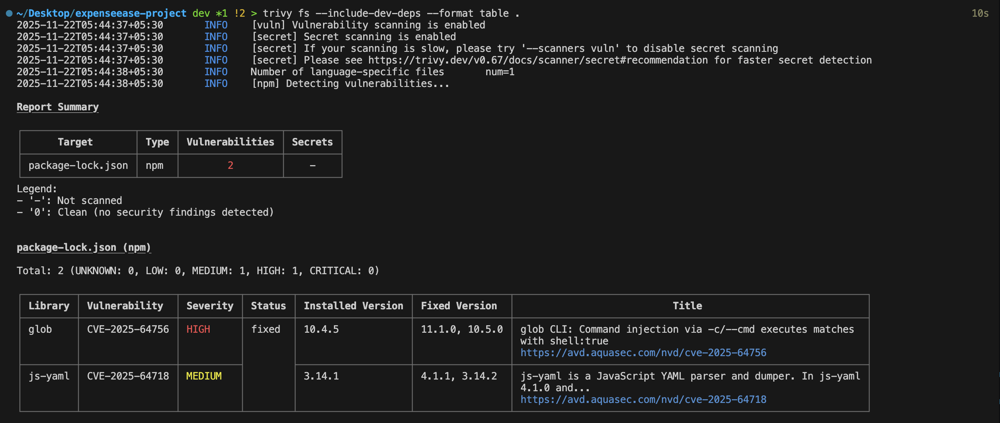
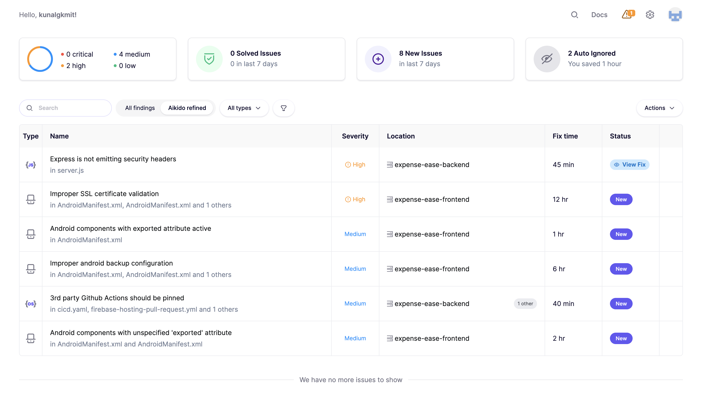
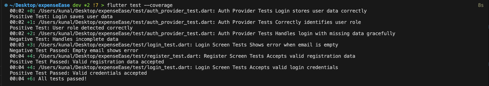
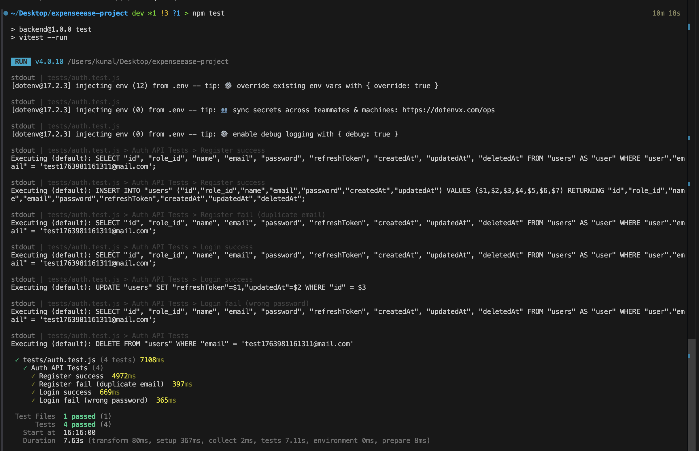
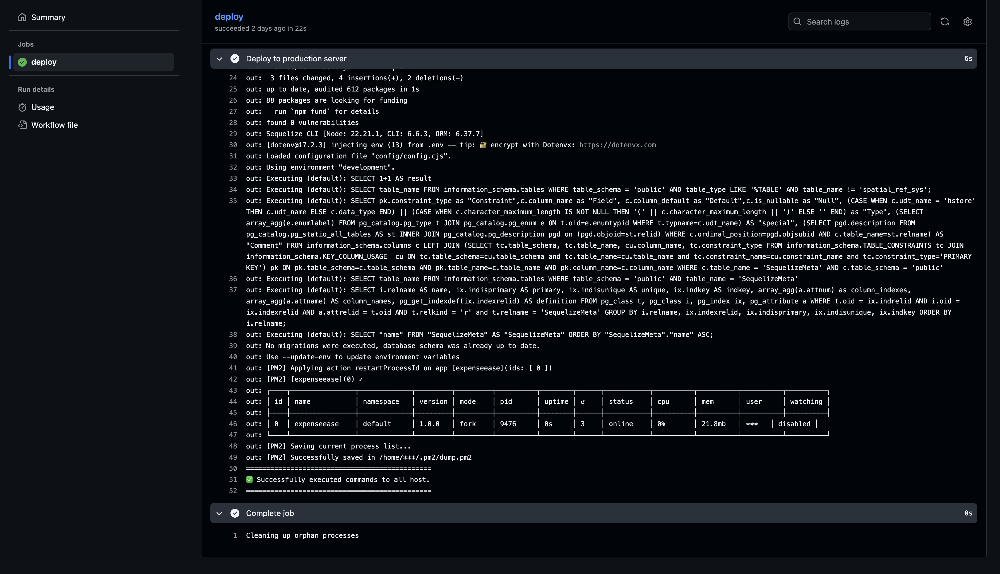

# Code Merge Workflow

## 1. Main Branch Initialization

The project began with the creation of the **main** branch containing the initial README and base setup.

- A PR was created for the initial commit into `main`
- The PR was reviewed and approved by the mentor

---

## 2. Create the Development Branch

A new **dev** branch was created from `main` for development work.

- The initial working project setup was pushed into `dev`
- A PR was raised:  
  `dev → main`
- The PR was reviewed and approved by the mentor
- `dev` then became the central integration branch

---

## 3. Feature Branch Workflow

Every new feature (frontend or backend) was developed in a dedicated feature branch created from `dev`.

---

## 4. Workflow for Each Feature

1. A feature branch was created from `dev`
2. Development for that specific feature was done inside the feature branch
3. When the work was complete, a PR was opened
4. The mentor reviewed the PR and provided suggestions/changes
5. All requested changes were implemented in the same feature branch
6. After approval, the PR was merged into `dev`

---

## 5. Dev Branch Stabilization and Final Merge

After all feature branches were completed and merged:

- The **dev** branch now contained all final, and reviewed features
- A final PR was created:  
  `dev → main`
- After review and approval, the PR was merged into the **main** branch

---

## Code Merge Workflow – Flowchart

# SAST and DAST-:
Frontend SAST

- For frontend SAST test I have used `trivy` by using `trivy fs --include-dev-deps --format table .`
- It scanned all my dependencies, dev dependencies and secrets if they are exposed or not.

Backend SAST

- For backend SAST test I have used `trivy` by using `trivy fs --include-dev-deps --format table .`
- It scanned all my dependencies, dev dependencies and secrets if they are exposed or not.

Aikido Report

- I have used `aikido` for thorough code testing for backend as well as frontend.
- `akido` detected all vulnarabilities in my frontend and backend repos and created a report on the basis of their severity.

---

# Test Case Report-:
Frontend Report

Backend Report

---

# Backend deployment on EC2 Workflow-:

---

# Frontend deployment-:
- The web version of `Expenseease` was developed and a `release build` was created using `flutter build web --release` and was deployed on `firebase`
- The mobile version of `Expenseease` was developed and a `release build` was created using `flutter build apk --release` command

