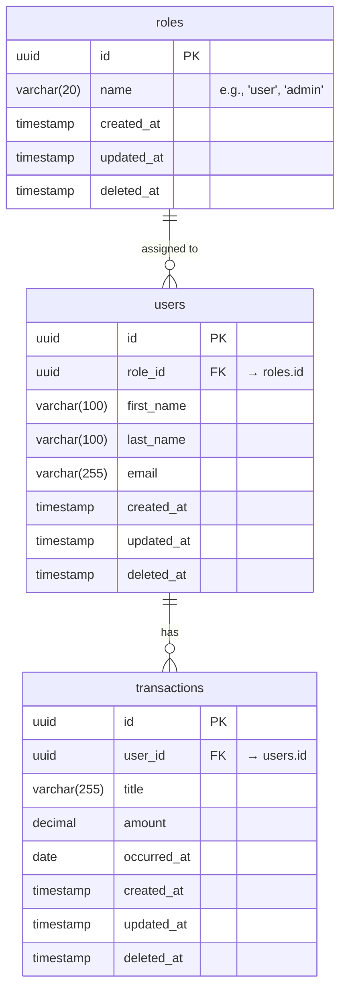
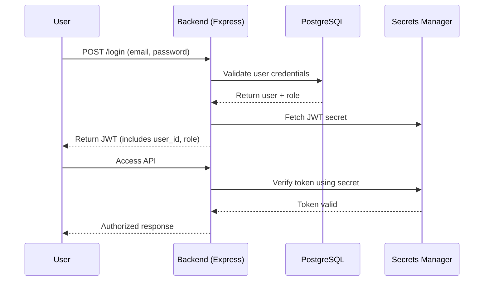

# Technical Documentation — Architecture, DFD, Auth & Authentication and Authorization flow

## 1. Architecture (AWS-specific)

---

## Data Flow Diagram

## Schema Design

## Authentication and Authorization flow
