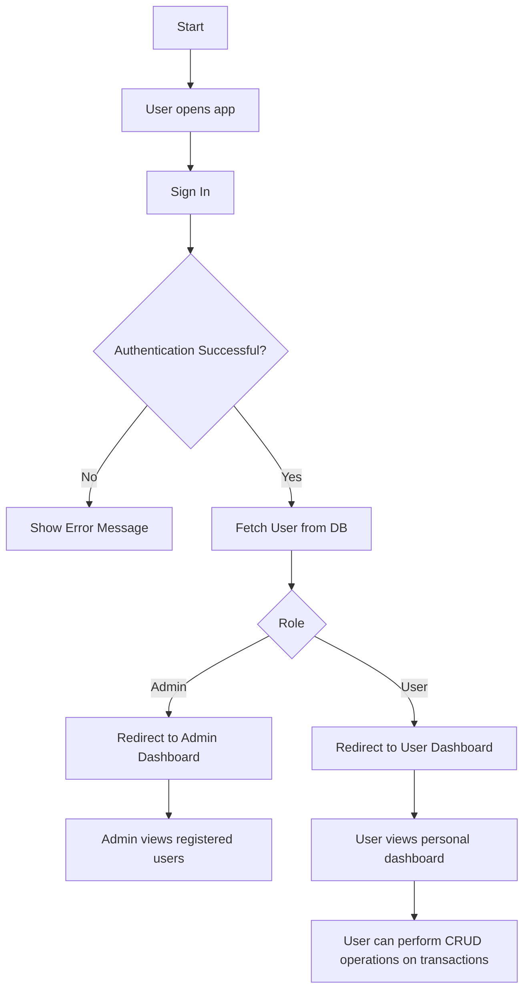

## Workflow

1. **User Authentication**

      - User signs up or logs in.
      - Backend verifies and syncs the user.

2. **Dashboard Initialization**

      - App fetches total balance, total income, expense, and recent transactions.

3. **Transaction Operations**

      - User can add, edit, or delete transactions.
      - Each change updates totals in real time.

4. **Admin Operations**

      - Admin views the count of registered users , their names and email.

5. **Logout**
      - User redirected to login screen.

---

## Flow Chart

