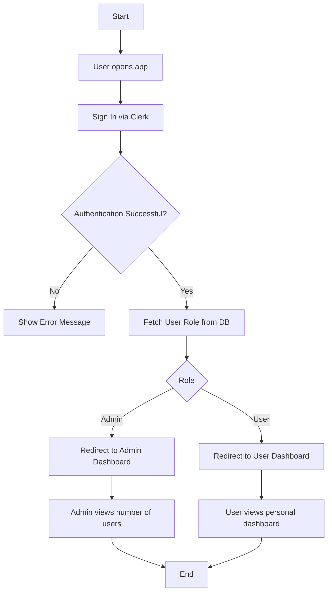
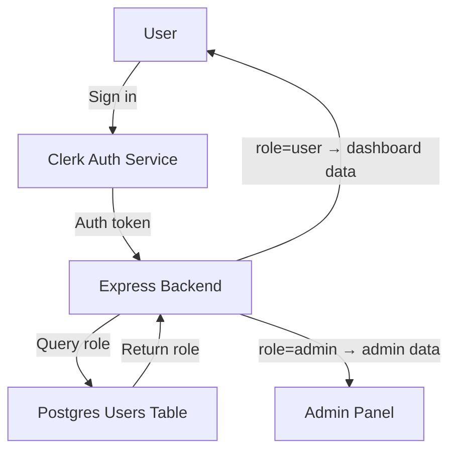
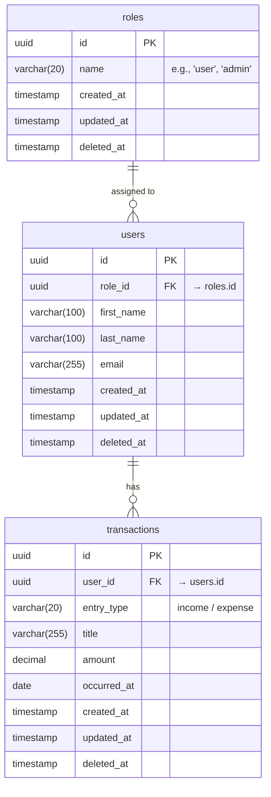

## Workflow

1. **User Authentication**

   - User signs up or logs in via Clerk.
   - Backend verifies Clerk session and syncs the user.

2. **Dashboard Initialization**

   - App fetches total income, expense, and recent transactions.

3. **Transaction Operations**

   - User can add, edit, or delete transactions.
   - Each change updates totals in real time.

4. **Chart Visualization**

   - User selects a custom date range to analyze income vs. expense.

5. **Admin Operations**

   - Admin views registered users through a secure endpoint.

6. **Logout**
   - Session token is cleared; user redirected to login screen.

---

## Flow Chart

---

## Data Flow Diagram

---

## Schema Design

